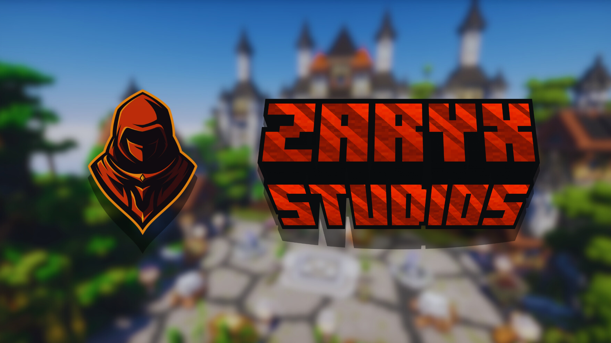
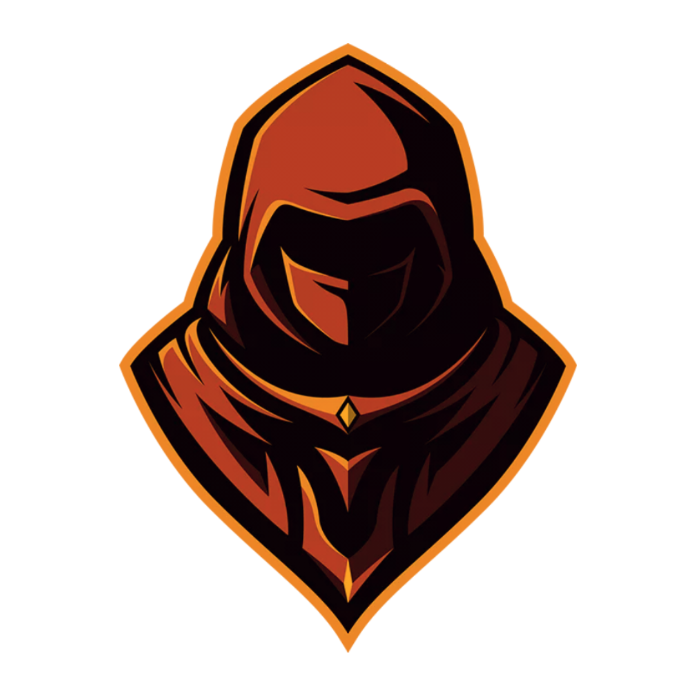
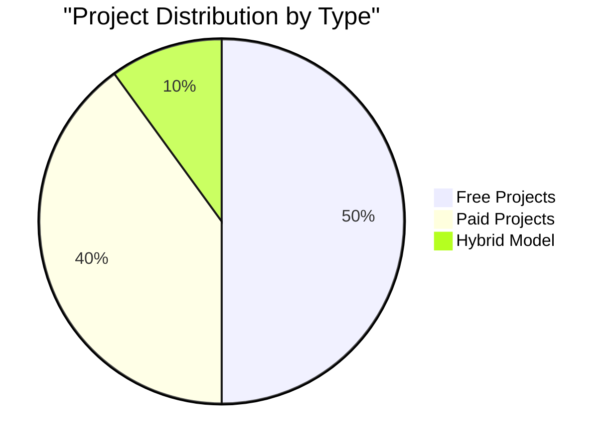

<!-- Banner Hero Section -->
<p align="center">
  
</p>

<br>

<!-- Logo & Title Section -->
<div align="center">
  
  
  <h1 style="font-size: 3em; margin: 0;">
    
  </h1>
  
  <h3>💎 Transforming Ideas Into Code 💎</h3>
  
  <p>
    <strong>Building powerful tools for developers & Minecraft servers</strong>
  </p>
</div>

<!-- Badges -->
<p align="center">
  <a href="https://zaryxstudios.com">
    
  </a>
  <a href="https://docs.zaryxstudios.com">
    
  </a>
  <a href="https://store.zaryxstudios.dev/">
    
  </a>
</p>

<p align="center">
  <a href="http://discord.zaryxstudios.dev/">
    
  </a>
  <a href="https://x.com/ZaryxStudios">
    
  </a>
  <a href="https://www.youtube.com/@zaryxstudios">
    
  </a>
</p>

<br>

---

<br>

## 🗂️ PROJECT PORTFOLIO

<div align="center">

### 🔥 **ESCANER DIVISION** — *Core Systems*

</div>

<table align="center">
<tr>
<td align="center" width="33%">

### ⭐ Stars
**Crates Plugin**  
`🔄 Remake in Progress`

Advanced crate system with custom animations and rewards

[](https://github.com/ZaryxStudios/Stars)  


</td>
<td align="center" width="33%">

### 🌀 Ultra
**Prison Core**  
`⏳ Unplanned`

Complete prison server core with mines, ranks & economy

[](https://github.com/ZaryxStudios/Ultra)  


</td>
<td align="center" width="33%">

### 💧 Water
**Kits & Enchants**  
`🚧 In Development`

Custom kits and enchantment system for enhanced gameplay

[](https://github.com/ZaryxStudios/Water)  


</td>
</tr>
<tr>
<td align="center" width="50%">

### 🔥 Fire
**Minions Core**  
`⏳ Unplanned`

Automated minion system for resource gathering

[](https://github.com/ZaryxStudios/Fire)  


</td>
<td align="center" width="50%">

### 🐦 Crow
**Economy Core**  
`🧪 Testing Stage`

Robust multi-currency economy system with bank support

[](https://github.com/ZaryxStudios/Crow)  


</td>
</tr>
</table>

<br>

<div align="center">

### ⚔️ **CAPITO DIVISION** — *Combat & Management*

</div>

<table align="center">
<tr>
<td align="center" width="33%">

### ⚔️ Bonty
**KoTH Plugin**  
`🧪 Testing Stage`

King of the Hill plugin with custom zones and rewards

[](https://github.com/ZaryxStudios/Bonty)  


</td>
<td align="center" width="33%">

### 🪽 Limbo v2
**BoxPvP Core**  
`🚧 In Development`

Complete BoxPvP experience with kits, arenas & stats

[](https://github.com/ZaryxStudios/Limbo)  


</td>
<td align="center" width="33%">

### 👔 Sufaris
**Management Core**  
`🚧 In Development`

Server management suite with moderation tools

[](https://github.com/ZaryxStudios/Sufaris)  


</td>
</tr>
</table>

<br>

<div align="center">

### 🌌 **ANLY DIVISION** — *Platform & Tools*

</div>

<table align="center">
<tr>
<td align="center" width="50%">

### ☄️ Odyssey
**Hub Core**  
`🚧 In Development`

Feature-rich hub core with NPCs, holograms & more

[](https://github.com/ZaryxStudios/Odyssey)  


</td>
<td align="center" width="50%">

### 📨 Clap
**Translator Core**  
`🧪 Testing Stage`

Multi-language translation system with API support

[](https://github.com/ZaryxStudios/Clap)  


</td>
</tr>
</table>

<br>

---

<br>

## 📊 TEAM STATISTICS

<div align="center">

### 👥 Our Core Developers

<br>

<!-- EscanerGang Stats -->
<table>
<tr>
<td align="center">
<br>
<sub><b>🔥 EscanerGang</b></sub><br>
<sub>Lead Developer • Escaner Division</sub>
</td>
</tr>
</table>

<a href="https://github.com/EscanerGang">
  
</a>
<a href="https://github.com/EscanerGang">
  
</a>

<br><br>

<!-- CapitoMC Stats -->
<table>
<tr>
<td align="center">
<br>
<sub><b>⚔️ CapitoMC</b></sub><br>
<sub>Senior Developer • Capito Division</sub>
</td>
</tr>
</table>

<a href="https://github.com/CapitoMC">
  
</a>
<a href="https://github.com/CapitoMC">
  
</a>

<br><br>

<!-- Vyran1 Stats -->
<table>
<tr>
<td align="center">
<br>
<sub><b>🌌 Vyran1</b></sub><br>
<sub>Platform Engineer • Anly Division</sub>
</td>
</tr>
</table>

<a href="https://github.com/Vyran1">
  
</a>
<a href="https://github.com/Vyran1">
  
</a>

<br><br>

### 💻 Combined Tech Stack


<br>

### 🛠️ Technologies We Use


<br>


<br><br>

### 📈 Team Activity


<br>

[](https://github.com/EscanerGang)
[](https://github.com/CapitoMC)
[](https://github.com/Vyran1)

</div>

<br>

---

<br>

## 🚀 GETTING STARTED

```bash
# Clone any of our repositories
git clone https://github.com/ZaryxStudios/[PROJECT_NAME].git

# Navigate to project directory
cd [PROJECT_NAME]

# Build with Gradle
./gradlew build

# Run tests
./gradlew test
```

<br>

---

<br>

## 🤝 JOIN THE COMMUNITY

<div align="center">

<h3>🌟 We're always looking for passionate developers, testers, and contributors! 🌟</h3>

<br>

<a href="http://discord.zaryxstudios.dev/">
  
</a>
&nbsp;&nbsp;&nbsp;
<a href="../CONTRIBUTING.md">
  
</a>
&nbsp;&nbsp;&nbsp;
<a href="https://x.com/ZaryxStudios">
  
</a>

<br><br>

### 💡 Ways to Contribute

<table>
<tr>
<td align="center" width="25%">
<br>
<b>Report Bugs</b><br>
<sub>Help us improve</sub>
</td>
<td align="center" width="25%">
<br>
<b>Submit PRs</b><br>
<sub>Contribute code</sub>
</td>
<td align="center" width="25%">
<br>
<b>Improve Docs</b><br>
<sub>Write guides</sub>
</td>
<td align="center" width="25%">
<br>
<b>Star Repos</b><br>
<sub>Show support</sub>
</td>
</tr>
</table>

</div>

<br>

---

<br>

## 🏆 ACHIEVEMENTS & MILESTONES

<div align="center">


<br><br>

### 🎯 Project Status Overview



</div>

<br>

---

<br>

## 👨‍💻 MEET THE TEAM

<div align="center">

| Developer | Role | Division | Specialization | GitHub |
|-----------|------|----------|----------------|--------|
| **🔥 EscanerGang** | Lead Developer | Escaner | Core Systems & Economy | [@EscanerGang](https://github.com/EscanerGang) |
| **⚔️ CapitoMC** | Senior Developer | Capito | Combat & Management | [@CapitoMC](https://github.com/CapitoMC) |
| **🌌 Vyran1** | Platform Engineer | Anly | Hub & Translation Tools | [@Vyran1](https://github.com/Vyran1) |

</div>

<br>

---

<br>

## 📜 LICENSE & CREDITS

<div align="center">


<br><br>

Most projects are licensed under **MIT License** unless specified otherwise.

**Made with ❤️ by the Zaryx Studios Team**

<br>

[](https://github.com/ZaryxStudios)
[](https://zaryxstudios.com)

<br>

---

<br>

<h3><i>"Code is poetry, and we're the poets."</i> ✨</h3>

<br>

<sub>© 2024 Zaryx Studios. All rights reserved.</sub>

</div>